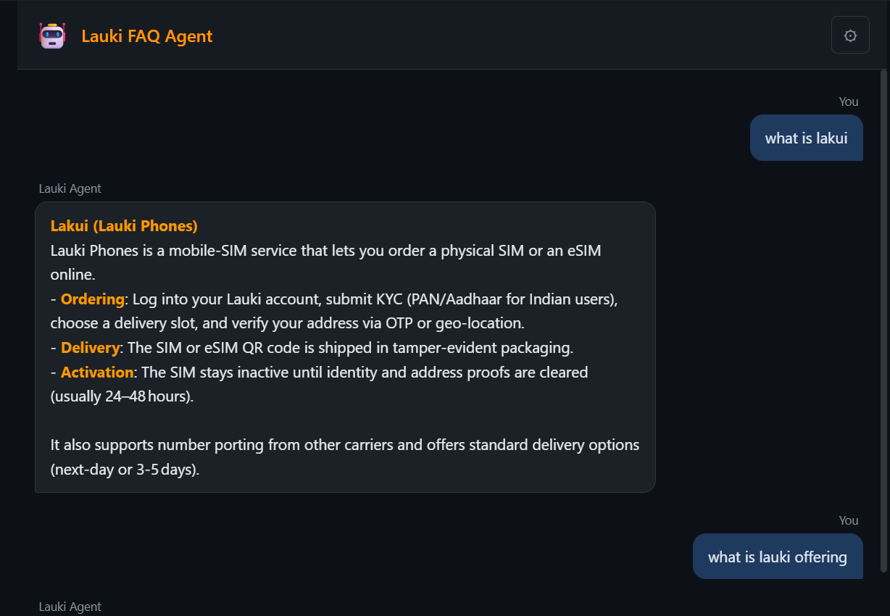

# Lauki FAQ Agent


[](https://github.com/francis-rf/faq-bedrock-agentcore/actions/workflows/deploy.yml)
[](https://vbfapqsnrw.us-east-1.awsapprunner.com/)

A conversational FAQ agent for **Lauki Phones** — a fictional mobile carrier — answering questions about plans, SIM activation, billing, roaming, eSIM, and device support.
Built with a LangGraph ReAct agent deployed on AWS Bedrock AgentCore, with a FastAPI web UI hosted on App Runner.

> **Live Demo:** [https://vbfapqsnrw.us-east-1.awsapprunner.com/](https://vbfapqsnrw.us-east-1.awsapprunner.com/)

## 🎯 Features

- **Semantic FAQ Search**: FAISS vector store with sentence-transformers for similarity search
- **Persistent Memory**: Conversation history via AgentCore Memory (LangGraph checkpointing)
- **S3-Backed Storage**: FAQ dataset and FAISS index persisted to S3 — no cold-build on restart
- **Web Chat UI**: HTML/CSS/JS chat interface served by a FastAPI proxy
- **Two-Container Architecture**: ARM64 agent backend + AMD64 web server
- **Cloud-Native**: Secrets Manager for API keys, ECR for images, AgentCore for runtime

## 🛠️ Tech Stack

- **Agent**: LangGraph ReAct agent, LangChain, Groq (llama-3.3-70b)
- **Search**: FAISS, sentence-transformers (`all-MiniLM-L6-v2`)
- **Backend**: AWS Bedrock AgentCore, S3, Secrets Manager, ECR
- **Web**: FastAPI, uvicorn, boto3
- **CI/CD**: GitHub Actions → ECR → App Runner

## 🚀 Quick Start

### Prerequisites

- Python 3.11+
- AWS credentials configured (`aws configure`)
- Groq API key

### Installation

1. Clone the repository:

```bash
git clone https://github.com/francis-rf/faq-bedrock-agentcore.git
cd faq-bedrock-agentcore
```

2. Install web server dependencies:

```bash
pip install -r requirements.web.txt
```

3. Set environment variables:

```bash
export AGENT_RUNTIME_ARN="arn:aws:bedrock-agentcore:<region>:<account>:runtime/<id>"
export AWS_REGION="us-east-1"
```

4. Run:

```bash
uvicorn server:app --port 8000
```

5. Open browser: `http://localhost:8000`

## 🐳 Docker Deployment

### Web Server (AMD64)

```bash
docker build -f Dockerfile.web -t faq-agent-web .
docker run -p 8000:8000 \
  -e AGENT_RUNTIME_ARN=<arn> \
  -e AWS_REGION=us-east-1 \
  faq-agent-web
```

### Agent Backend (ARM64)

```bash
docker buildx build --platform linux/arm64 -f Dockerfile -t faq-agent .
```

## ☁️ AWS Deployment

### Services Used

| Service | Purpose |
|---------|---------|
| ECR | Container image registry (two repos) |
| Bedrock AgentCore | ARM64 agent runtime hosting |
| App Runner | AMD64 web server hosting |
| S3 (`faq-agent-data`) | FAQ CSV + FAISS vectorstore |
| Secrets Manager (`faq-agent`) | GROQ_API_KEY + MEMORY_ID |
| IAM | Runtime role + App Runner instance role |

### Setup

1. Store secrets in **AWS Secrets Manager** under `faq-agent` (`GROQ_API_KEY`, `MEMORY_ID`)
2. Upload `data/qna.csv` to **S3** bucket `faq-agent-data`
3. Build ARM64 image on EC2 Graviton → push to ECR (`faq-agent`)
4. Create **AgentCore** runtime pointing to ECR image + IAM role
5. Build AMD64 web image → push to ECR (`faq-agent-web`)
6. Create **App Runner** service with `AGENT_RUNTIME_ARN` + `AWS_REGION` env vars and instance role

### Live URL

**[https://vbfapqsnrw.us-east-1.awsapprunner.com/](https://vbfapqsnrw.us-east-1.awsapprunner.com/)**

## ⚙️ GitHub Actions CI/CD

Automated deployment configured via `.github/workflows/deploy.yml`.

### Workflow: Deploy FAQ Agent

On every push to `main`, two jobs run in parallel:

**deploy-web**
1. **Checks out** the code
2. **Configures** AWS credentials
3. **Logs in** to Amazon ECR
4. **Builds & pushes** AMD64 web image (tagged with commit SHA and `latest`)
5. **Triggers** App Runner redeployment via `start-deployment`

**deploy-agent**
1. **Sets up** QEMU + Docker Buildx for ARM64 cross-compilation
2. **Configures** AWS credentials
3. **Logs in** to Amazon ECR
4. **Builds & pushes** ARM64 agent image to ECR

### Required GitHub Secrets

| Secret | Description |
|--------|-------------|
| `AWS_ACCESS_KEY_ID` | IAM user access key (`faq-agentcore`) |
| `AWS_SECRET_ACCESS_KEY` | IAM user secret key |
| `APP_RUNNER_SERVICE_ARN` | App Runner service ARN |

### Workflow Status

[](https://github.com/francis-rf/faq-bedrock-agentcore/actions/workflows/deploy.yml)

## 📁 Project Structure

```
faq-bedrock-agentcore/
├── src/
│   ├── agent.py              # FAQAgent — LangGraph graph + tool binding
│   ├── knowledge_base.py     # FAQKnowledgeBase — FAISS index (S3-backed)
│   ├── tools.py              # search_faq, search_detailed_faq, reformulate_query
│   ├── memory.py             # AgentCore Memory middleware
│   └── utils/
│       ├── settings.py       # Config values (S3, Secrets, region)
│       └── logger.py         # Centralized logging
├── frontend/
│   ├── index.html            # Chat UI
│   ├── style.css             # Dark theme
│   └── app.js                # Fetch /chat, render bubbles
├── data/
│   └── qna.csv               # FAQ dataset (also stored in S3)
├── main.py                   # AgentCore entrypoint (BedrockAgentCoreApp)
├── server.py                 # FastAPI proxy — serves UI + forwards to AgentCore
├── Dockerfile                # ARM64 agent backend image
├── Dockerfile.web            # AMD64 web server image
├── requirements.txt          # Agent dependencies
├── requirements.web.txt      # Web server dependencies
└── .github/workflows/
    └── deploy.yml            # CI/CD pipeline
```

## 📡 API Endpoints

| Method | Endpoint | Description |
|--------|----------|-------------|
| GET | `/` | Serves the web chat UI |
| GET | `/health` | Health check — returns status and runtime ARN |
| POST | `/chat` | Send a message to the FAQ agent |

## 📸 Screenshots


Lauki FAQ Agent — Web Chat Interface

## 📄 License

MIT License
